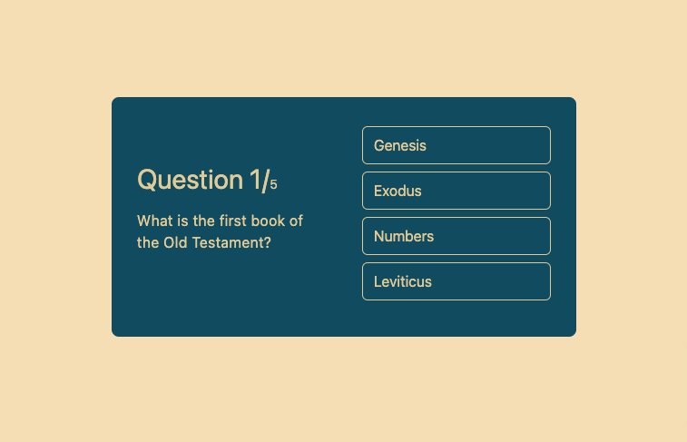

# Quiz App with React using Vite

This is a quiz app built with React, utilizing the Fetch API to retrieve quiz questions from the Open Trivia Database (opentdb.com). The app uses `useState` and `useEffect` hooks to display the questions and answers in the `QuestionBox` component. Once all the questions are answered, the `ResultBox` component is shown, displaying the user's result and the correct answers for each question. The app's styling is done using Tailwind CSS. The project was created using Vite as the build tool.

## Table of Contents

- [Demo](#demo)
- [Features](#features)
- [Installation](#installation)
- [Usage](#usage)
- [Technologies](#technologies)
- [Contributing](#contributing)
- [License](#license)

## Demo

---
[Live Version](https://shayan-react-quiz.netlify.app)

## Features

- Fetches quiz questions from the Open Trivia Database (opentdb.com).
- Displays questions and answer choices using the `QuestionBox` component.
- Shows the user's quiz result and correct answers after completing the quiz using the `ResultBox` component.
- User can refresh the quiz to start again.
- Styling using Tailwind CSS for a responsive and visually appealing interface.

## Installation

1. Clone this repository to your local machine.

```bash
git clone https://github.com/your-username/quiz-app.git
```

2. Navigate to the project directory.

```bash
cd quiz-app
```

3. Install the required dependencies using npm or yarn.

```bash
npm install
```
or
```bash
yarn
```

## Usage

1. Run the development server.

```bash
npm run dev
```
or
```bash
yarn dev
```

2. Open your web browser and go to `http://localhost:3000` to access the quiz app.

3. Start taking the quiz by answering the questions presented in the `QuestionBox` component.

4. After answering all the questions, the `ResultBox` component will be displayed, showing your quiz result and the correct answers.

5. You can refresh the page to restart the quiz.

## Technologies

- React
- Vite
- Fetch API
- Tailwind CSS

## Contributing

Contributions are welcome! If you find any issues or want to enhance the app, feel free to open a pull request.